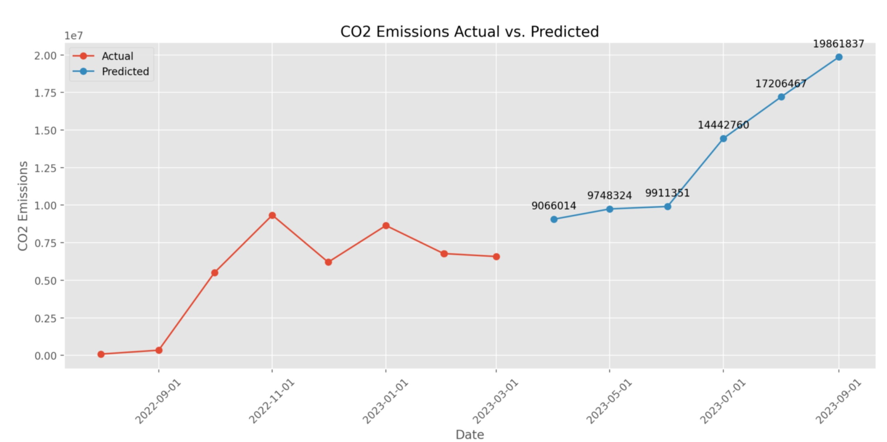

# Green Mobility Tool

## Project Description
The Green Mobility Tool is designed to predict CO2 emissions from company workers' commutes based on historical data inputs over varied periods. This application not only forecasts future emissions but also analyzes trends in commuting behavior and the impact of climatic variables on these trends.

## How It Works
The application consists of several key components:

1. **Data Analysis**:
   - The system initially processes historical commute data from multiple companies across different times of the year to identify patterns and trends. This includes assessing how weather conditions affect commuting choices, like the increase in bicycle use during favorable weather.

2. **Outlier Detection**:
   - Special algorithms are employed to detect anomalies in the data, particularly focusing on the types of vehicles used. This helps in refining the data for more accurate predictions.

3. **Machine Learning Models**:
   - The cleaned and processed data is used to train machine learning models that can predict CO2 emissions based on various input parameters. These models are saved to a GitHub repository for version control and easy access.

4. **Streamlit Application**:
   - A separate Python script fetches these ML models from GitHub and runs a Streamlit application. Users interact with this application by uploading their data, and the models provide predictions which are then visualized on the dashboard.

## Technology Stack
- **Programming Language**: Python
- **Deployment**: Streamlit
- **Data Analysis and Machine Learning**: Various Python libraries such as Pandas, Scikit-Learn
- **Version Control**: Git for model versioning

## How to Use the App
1. **Access the Application**:
   - Navigate to the Streamlit app URL: 
    [Green Mobility Tool on Streamlit](https://co2predict-j4pner6xzxtn3uqpmsosqv.streamlit.app/)
2. **Upload Data**:
   - Upload an Excel [formatted file](input_file.xlsx) with the required data format detailing commute information over the desired period.
3. **View Predictions**:
   - The app will display CO2 emission predictions and related trends directly on the dashboard. 

## Features
- **Trend Analysis**: Analyzes how commuting behaviors change over different periods and under varying weather conditions.
- **CO2 Emission Prediction**: Utilizes advanced ML models to predict emissions from commuting data.
- **Data-Driven Insights**: Provides actionable insights into how commuting patterns can be altered to reduce overall CO2 emissions.

## Contributing
Contributions are welcome! If you're interested in enhancing the features, refining predictions, or addressing bugs, please fork the repository and submit a pull request with your changes.

## Author
- **Adilbek Aituarov** - (https://github.com/aituarov/)
